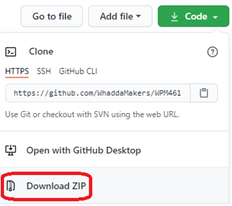
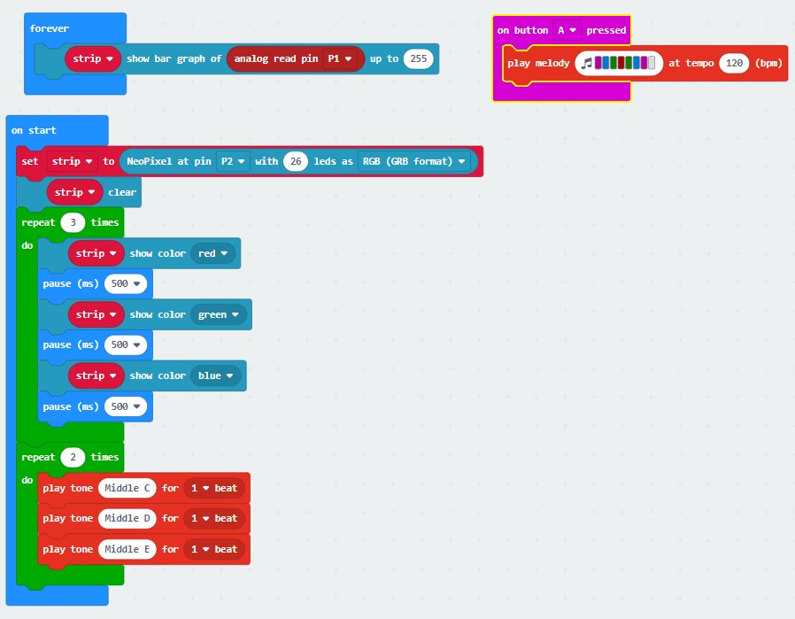

# WPSE475 Whadda RGB LED ring shield for micro:bit


This example shows off all of the different sensors and LEDs on the RGB LED ring shield.
It will show a standard test sequence of the RGB LEDs, play a tune on the buzzer. Afterwards, the LEDs will behave like a simple VU meter using the built-in microphone.

## Extensions used
* neopixel

## Running the example

1. Download the example program by clicking the “**Download ZIP**” link in the “Code” menu:
   
   

2. Unzip the downloaded file
3. Go to [makecode.microbit.org](https://makecode.microbit.org/) and start a new project
4. Drag the ```example_code.hex``` that is located in the folder you unzipped to the empty makecode blocks workspace. The sample code blocks should appear on your screen:
  
5. Download the code to your micro:bit

## Additional information
  For more information about the Whadda WPM463 2 channel Solid State Relay module, check the manual available at [whadda.com](https://whadda.com) 